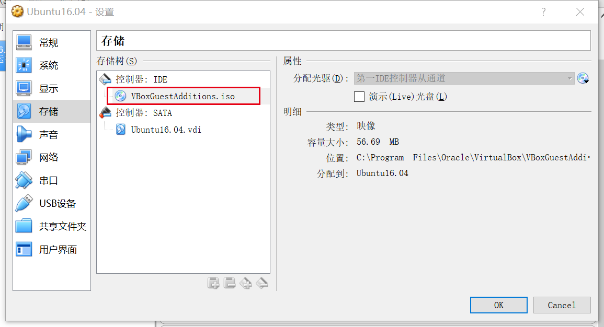
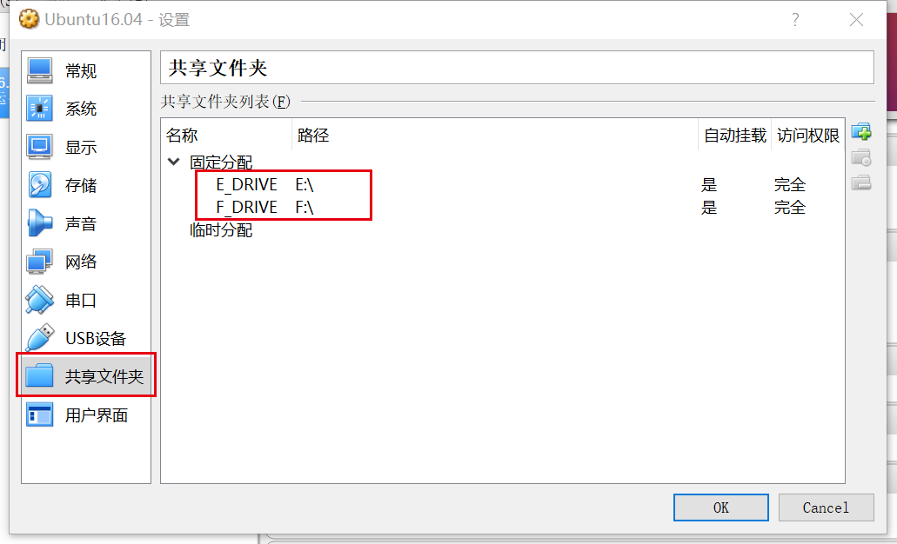

# 虚拟机共享文件夹
使用VitrualBox安装虚拟机后，经常需要在宿主机与虚拟机中进行文件的共享。VirtualBox已经提供了非常好的工具可以供我们进行文件共享。只需要进行以下简单设置即可：  
* 准备将被挂载的文件VboxGuestAddtions.iso

这个文件并不需要重新下载，他已经存在你的电脑中了，路径如下：  
`C:\Program Files\Oracle\VirtualBox\VBoxGuestAdditions.iso`

* 虚拟机安装插件
完成以上两步之后，启动虚拟机，挂载镜像：
``` sh
transfer@transfer-vb:/$ sudo mount /dev/cdrom /home/temp
```
其中temp文件夹是一个挂载点，可以自己随意设置。  
接下来安装插件：
``` sh
transfer@transfer-vb:/$ cd /home/temp/
transfer@transfer-vb:/home/temp$ ./VBoxLinuxAdditions.run
```

* 设置共享文件夹
以下方式选择自动的方式进行挂载：
  
当然也可以手动的挂载：
```
transfer@transfer-vb:/media$ mount -t vboxsf E_DRIVE /media/E_DRIVE
```

* 修改用户权限
通过以上步骤后，进入虚拟机后就可以看到被挂载的文件夹了，路径为：`/media/`
但是普通用户无法进入，只有root用户才能够进入。那么我们来查看一下文件夹的属性：
```
transfer@transfer-vb:/media$ ls -al
drwxr-xr-x   5 root root   4096 7月   1 23:40 .
drwxr-xr-x  24 root root   4096 7月   1 00:46 ..
drwxrwx---   1 root vboxsf 4096 7月   1 23:28 sf_E_DRIVE
drwxrwx---   1 root vboxsf 4096 7月   1 23:28 sf_F_DRIVE
```
从这里可以看到文件夹的属于`vboxsf`用户组，因此你是无法进行访问的。那么你需要通过修改`/etc/group`文件，将自己加入用户组中
更改前：
``` sh
transfer@transfer-vb:/media$ cat /etc/group
...
vboxsf:x:999:
```
更改后：
``` sh
transfer@transfer-vb:/media$ cat /etc/group
...
vboxsf:x:999:transfer
```
