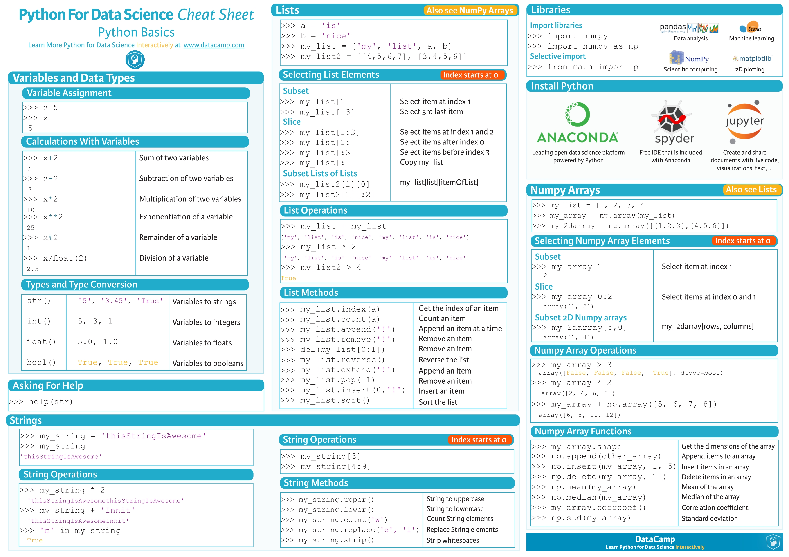
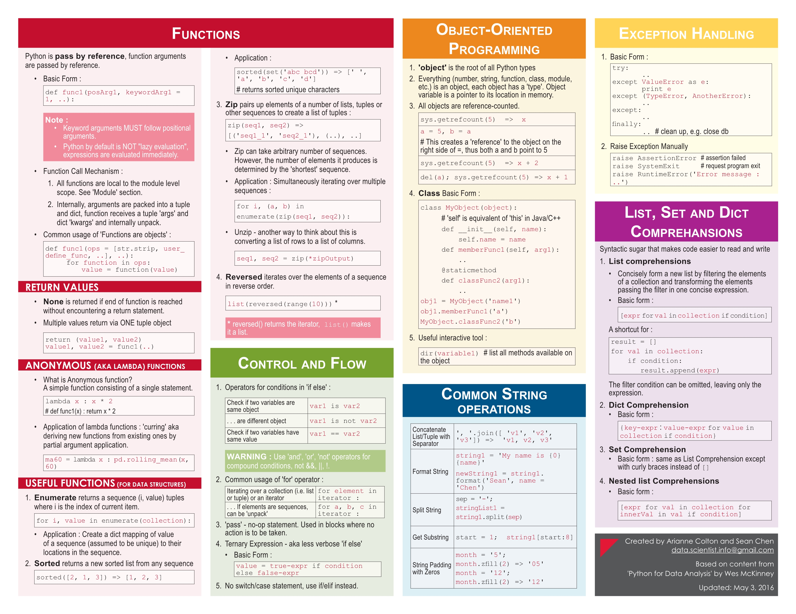
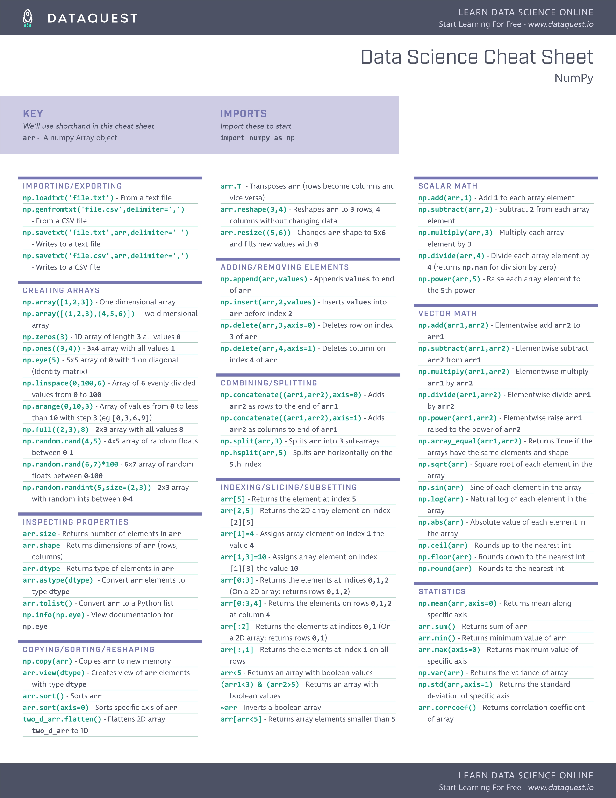
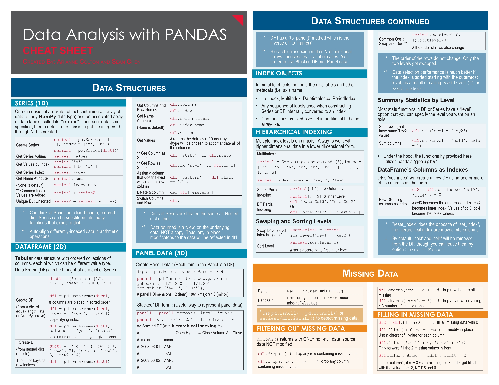
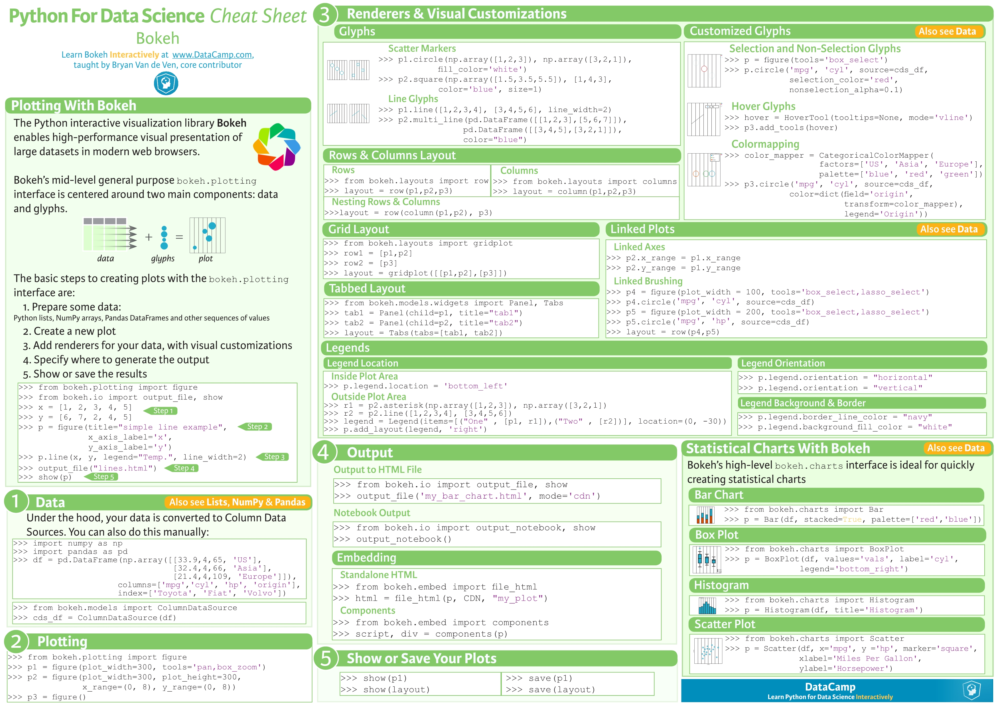
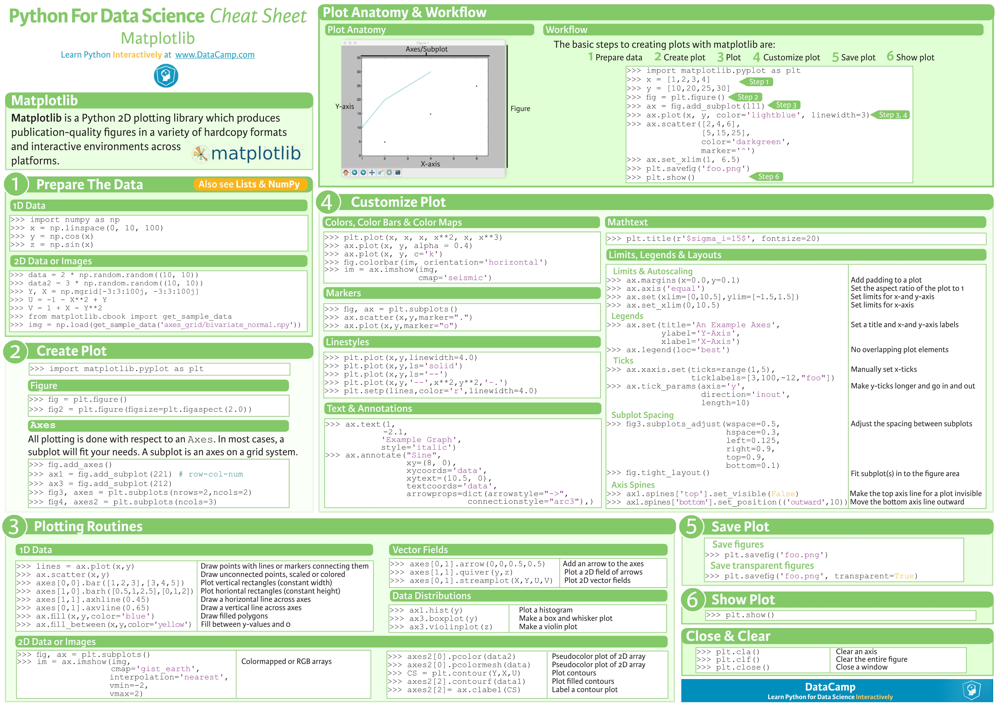
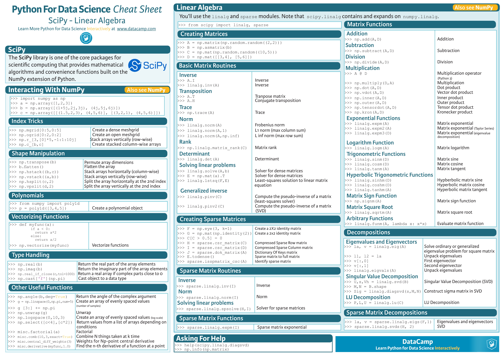
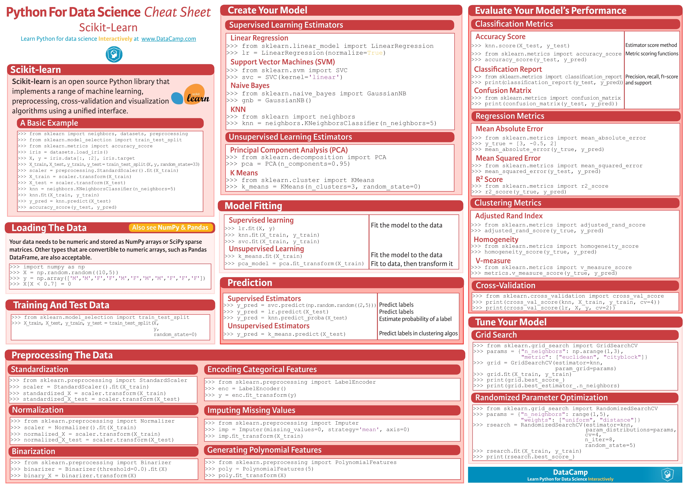

# 数据科学速查表
* Python Basic

* Python Basic2

* NumPy Basics

* NumPy Basics2

* Pandas

* Bokeh

* Matplotlib

* SciPy

* Scikit

## 参考资料：  
* [可能是史上最全的机器学习和Python（包括数学）速查表](https://mp.weixin.qq.com/s?__biz=MzI4NjYwMjcxOQ==&mid=2247484157&idx=1&sn=2efcdaf89d213f00dcfe0c32a7e63b41)  
* [在线数据分析学习网站](https://www.datacamp.com/community/tutorials)
